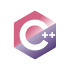
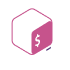
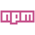
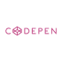

```
________      __    __           __                       ________               
\_    _/ ___ |  | _|  | __ _____/  |_ __ __  ________ __  \______ \   _______  __
  |  |_/ __ \|  |/ /  |/ // __ \   __\  |  \/  ___/  |  \  |    |  \_/ __ \  \/ /
  |  |\  ___/|    <|    <\  ___/|  | |  |  /\___ \|  |  /  |  __|   \  ___/\   / 
  |__| \___  >__|_ \__|_ \\___  >__| |____//____  >____/  /_______  /\___  >\_/  
           \/     \/    \/    \/                \/                \/     \/      
```


# ${\color{#C6538C}Welcome \space to \space my \space repository \space (づ｡◕‿‿◕｡)づ}$

👾 - Hi there! I'm am Victor Jamet a junior self-taught web Developer focus on HTML, CSS and Javascript.

💻 - I'm currently working on a web Portofolio with HTML/SCSS and Vanilla Javascript expandanding my knowledge of the basis to work with more advanced Frameworks and Libraries in the future.

⚙️ - My technical skillset includes HTML/CSS, Javascript, C++, Bash, Figma and more, and I'm passionate about using these tools to create unique User Interfaces, IA projects, Software Development ...

📄 - Please check out my <a href="https://drive.google.com/file/d/1Gh4q_RSMQUjufm2Qrm-QesiBepiZ79rO/view?usp=share_link"> CV/Resume </a> for more information about my experience and skills.  

🎨 - For me creating webpages requieres some level of artistic and comprehensive skill to implement the UI ideas. So that's why I put the effort on learning and improving my layout ideas to keep up to date with my coding skills. 

💼 I'm always open to work whereas I can combine it with my Computer Science degree at UOC (Universitat Oberta de Catalunya Online)

<br/>

 $${\color{#C6538C}Teck\space Stack}$$

I expent the last 3 years working on developing my skillset as a developer. After trying lots of configurations API's, programming languages I bluid a decent Teck Stack to work with.

<!---
| ${\color{#C6538C}Project\space Field}$ | ${\color{#C6538C}Tools\space I \space use\space}$ |
|:---------------:|:-------------:|
| Web Devolment |         |
| Software Development |    |
| Cloud |  |
| Scripting |  |
| Videosgames | |
| General Use |    |
--->

<br/>


<br/>

## ${\color{#C6538C}Can\space Find \space me \space here}$

| $${\color{#C6538C}Platform}$$ | $${\color{#C6538C}Link}$$|
| :-----------: | :-----------: |
|  | https://tekketsudev.com |
|  | https://linkedin.com/in/víctor-jamet-soler |
|  | https://www.figma.com/@TekketsuDev |
|  | https://codepen.io/tekketsudev |
|  | https://github.com/TekketsuDev |


  
