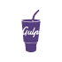
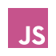
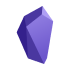

<span style="color: red;"> asdf </span>
```
________      __    __           __                       ________               
\_    _/ ___ |  | _|  | __ _____/  |_ __ __  ________ __  \______ \   _______  __
  |  |_/ __ \|  |/ /  |/ // __ \   __\  |  \/  ___/  |  \  |    |  \_/ __ \  \/ /
  |  |\  ___/|    <|    <\  ___/|  | |  |  /\___ \|  |  /  |  __|   \  ___/\   / 
  |__| \___  >__|_ \__|_ \\___  >__| |____//____  >____/  /_______  /\___  >\_/  
           \/     \/    \/    \/                \/                \/     \/      
```

<br>

# Hi everyone 

<p>· 👾  &nbsp; Hi there! I'm Am Victor a junior self-taught web Developer focus on HTML, CSS and Javascript </p>
<p>· 💻 &nbsp;I'm currently working on a web Portofolio with HTML/SCSS and Vanilla Javascript expandanding my knowledge of the basis to work with more advanced Frameworks and Libraries in the future.</p>
<p>· ⚙️ &nbsp;My technical skillset includes HTML/CSS, Javascript, C++, Bash, Figma and more, and I'm passionate about using these tools to create unique User Interfaces, ... </p>
<p>· 📄 &nbsp;Please check out my <a href="https://drive.google.com/file/d/1Gh4q_RSMQUjufm2Qrm-QesiBepiZ79rO/view?usp=share_link">$${\color{#563D7C}CV \space}$$</a> for more information about my experience and skills.</p>
<p>· 🤝 &nbsp;I'm always open to work meanwhile I study Computer Science in UOC (Universitat Oberta de Catalunya)</p>
<p> ·🎨 &nbsp;For me creating webpages requieres some level of artistic and comprehensive skill to implement the UI ideas that comes from the designer. So that's why I put the effort on learning and improving my layout ideas to keep up to date with my coding skills</p>

<br>


## Teck Stack
I expent the last 3 years working on developing my skillset as a developer after trying lots of configurations API's, programming languages I bluid a decent Teck Stack to work with.
<table>
    <thead>
        <tr>
            <th>Project Field</th>
            <th>Tools I use</th>
        </tr>
    </thead>
    <tbody>
        <tr>
            <td>Web Devolment</td>
            <td>  
            
            
            
            
            
            
             </td>
        </tr>
        <tr>
            <td>Software Development</td>
            <td>
            
            
            </td>
        </tr>
        <tr>
            <td>Scripting</td>
            <td>
            </td>
        </tr>
        <tr>
            <td>IA Projects</td>
            <td> </td>
        </tr>
        <tr>
            <td>Cloud</td>
            <td></td>
        </tr>
        <tr>
            <td>Videogames</td>
            <td>
            </td>
        </tr>
        <tr>
            <td>General Use</td>
            <td>
             
            
            
            </td>
        </tr>
    </tbody>
</table>

<br>

<style>
    svg {
        height: 70px;
        width: 70px;
    }
    .cv {
        color: #C6538C;
    }
    a {
        text-decoration: none;
        color: #C6538C;
        font-weight: 700;
    }
    td {
        color: #C6538C;
    }
    a:visited, a:focus, a:hover {
        text-decoration: none;
        color: #563D7C;
    }
    p {
        color: #DDDDDD;
    }
    .language-tools {
        margin: 5px 20px;
    }

table {
width: 800px;
border-collapse: collapse;
overflow: hidden;
box-shadow: 0 0 20px rgba(0,0,0,0.1);
}
th,
td {
padding: 15px;
background-color: #dddd;
color: #fff;
cursor: pointer;
}
th {
text-align: left;
}
thead th{
    background-color: rgba(86, 61, 124, 0.64)
}
}
</style>


## All my Links
<br>
<table>
    <thead>
        <tr>
            <th>Platform</th>
            <th>Link</th>
        </tr>
    </thead>
    <tbody>
        <tr>
            <tr>
            <td><span style="font-weight: 700; color: #C6538C;">Personal Portofolio </span></td>
            <td><a>https://</a></td>
        </tr>
            <td></td>
            <td> <a> https://linkedin.com/in/víctor-jamet-soler </a>  </td>
        </tr>
        <tr>
            <td></td>
            <td> <a>https://www.figma.com/@TekketsuDev</a></td>
        </tr>
        <tr>
            <td> </td>
            <td><a>https://codepen.io/tekketsudev</a></td>
        </tr>
        <tr>
            <td></td>
            <td><a>https://github.com/TekketsuDev</a></td>
        </tr>
    </tbody>
</table>

